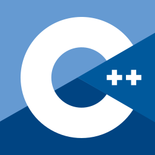
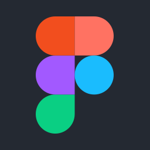
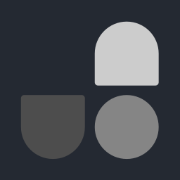
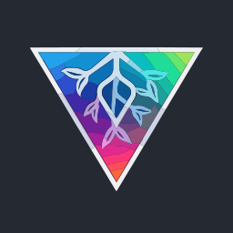

# MOBAIcons

<table>
  <tr>
    <td align="center" width="1000"> AMP</td>
    <td align="center" width="1000"> Android</td>
  </tr>
  <tr>
    <td align="center" width="1000"> Angular</td>
    <td align="center" width="1000"> Anime.js</td>
  </tr>
  <tr>
    <td align="center" width="1000"> Ant Design</td>
    <td align="center" width="1000"> Anthropic</td>
  </tr>
  <tr>
    <td align="center" width="1000"> Apple</td>
    <td align="center" width="1000"> Astro</td>
  </tr>
  <tr>
    <td align="center" width="1000"> Auk Browser</td>
    <td align="center" width="1000"> AWS</td>
  </tr>
  <tr>
    <td align="center" width="1000"> Axios</td>
    <td align="center" width="1000"> Azure</td>
  </tr>
  <tr>
    <td align="center" width="1000"> Babel</td>
    <td align="center" width="1000"> Base UI</td>
  </tr>
  <tr>
    <td align="center" width="1000"> Bash</td>
    <td align="center" width="1000"> Biome</td>
  </tr>
  <tr>
    <td align="center" width="1000"> Bitwarden</td>
    <td align="center" width="1000"> Blender</td>
  </tr>
  <tr>
    <td align="center" width="1000"> Blitz</td>
    <td align="center" width="1000"> Bolt</td>
  </tr>
  <tr>
    <td align="center" width="1000"> Bootstrap</td>
    <td align="center" width="1000"> Bun</td>
  </tr>
  <tr>
    <td align="center" width="1000"> Burning Hacker</td>
    <td align="center" width="1000"> C</td>
  </tr>
  <tr>
    <td align="center" width="1000"> Chart.js</td>
    <td align="center" width="1000"> Class Widgets</td>
  </tr>
  <tr>
    <td align="center" width="1000"> Classisland</td>
    <td align="center" width="1000"> Clerk</td>
  </tr>
  <tr>
    <td align="center" width="1000"> Cloudflare</td>
    <td align="center" width="1000"> COBOL</td>
  </tr>
  <tr>
    <td align="center" width="1000"> CodeSandbox</td>
    <td align="center" width="1000"> Color4bg</td>
  </tr>
  <tr>
    <td align="center" width="1000"> CPP</td>
    <td align="center" width="1000"> Crossplane</td>
  </tr>
  <tr>
    <td align="center" width="1000"> CSS</td>
    <td align="center" width="1000"> Cursor</td>
  </tr>
  <tr>
    <td align="center" width="1000"> Cypress</td>
    <td align="center" width="1000"> DaisyUI</td>
  </tr>
  <tr>
    <td align="center" width="1000"> Dart</td>
    <td align="center" width="1000"> Deepseek</td>
  </tr>
  <tr>
    <td align="center" width="1000"> Dify</td>
    <td align="center" width="1000"> Dioxus</td>
  </tr>
  <tr>
    <td align="center" width="1000"> Django</td>
    <td align="center" width="1000"> Docker</td>
  </tr>
  <tr>
    <td align="center" width="1000"> Docusaurus</td>
    <td align="center" width="1000"> Dotenv</td>
  </tr>
  <tr>
    <td align="center" width="1000"> Dotenvx</td>
    <td align="center" width="1000"> Drizzle</td>
  </tr>
  <tr>
    <td align="center" width="1000"> Dropbox</td>
    <td align="center" width="1000"> DuckDuckGo</td>
  </tr>
  <tr>
    <td align="center" width="1000"> Eclipse IDE</td>
    <td align="center" width="1000"> Electron Vite</td>
  </tr>
  <tr>
    <td align="center" width="1000"> Electron</td>
    <td align="center" width="1000"> ElysiaJS</td>
  </tr>
  <tr>
    <td align="center" width="1000"> Ember</td>
    <td align="center" width="1000"> ESLint</td>
  </tr>
  <tr>
    <td align="center" width="1000"> Excalidraw</td>
    <td align="center" width="1000"> Expo</td>
  </tr>
  <tr>
    <td align="center" width="1000"> Express.js</td>
    <td align="center" width="1000"> FastAPI</td>
  </tr>
  <tr>
    <td align="center" width="1000"> Fastify</td>
    <td align="center" width="1000"> Figma</td>
  </tr>
  <tr>
    <td align="center" width="1000"> Firebase Studio</td>
    <td align="center" width="1000"> FlashList</td>
  </tr>
  <tr>
    <td align="center" width="1000"> Flask</td>
    <td align="center" width="1000"> Fleet</td>
  </tr>
  <tr>
    <td align="center" width="1000"> Flowbite</td>
    <td align="center" width="1000"> Flutter</td>
  </tr>
  <tr>
    <td align="center" width="1000"> Fortran</td>
    <td align="center" width="1000"> Foundation Agents</td>
  </tr>
  <tr>
    <td align="center" width="1000"> Framer Motion</td>
    <td align="center" width="1000"> Fresh</td>
  </tr>
  <tr>
    <td align="center" width="1000"> Front</td>
    <td align="center" width="1000"> Fusion App</td>
  </tr>
  <tr>
    <td align="center" width="1000"> Gatsby</td>
    <td align="center" width="1000"> Gemini</td>
  </tr>
  <tr>
    <td align="center" width="1000"> Gin</td>
    <td align="center" width="1000"> Git</td>
  </tr>
  <tr>
    <td align="center" width="1000"> GitHub Copilot</td>
    <td align="center" width="1000"> GitHub</td>
  </tr>
  <tr>
    <td align="center" width="1000"> GitLab</td>
    <td align="center" width="1000"> Gleam</td>
  </tr>
  <tr>
    <td align="center" width="1000"> Gmail</td>
    <td align="center" width="1000"> Go</td>
  </tr>
  <tr>
    <td align="center" width="1000"> GraphQL</td>
    <td align="center" width="1000"> Grok</td>
  </tr>
  <tr>
    <td align="center" width="1000"> gRPC</td>
    <td align="center" width="1000"> GSAP</td>
  </tr>
  <tr>
    <td align="center" width="1000"> Haskell</td>
    <td align="center" width="1000"> hCaptcha</td>
  </tr>
  <tr>
    <td align="center" width="1000"> Headless UI</td>
    <td align="center" width="1000"> Hero UI</td>
  </tr>
  <tr>
    <td align="center" width="1000"> Home Assistant</td>
    <td align="center" width="1000"> Homebrew</td>
  </tr>
  <tr>
    <td align="center" width="1000"> Hono</td>
    <td align="center" width="1000"> Hoppscotch</td>
  </tr>
  <tr>
    <td align="center" width="1000"> HTML</td>
    <td align="center" width="1000"> Hugging Face</td>
  </tr>
  <tr>
    <td align="center" width="1000"> i18next</td>
    <td align="center" width="1000"> IntelliJ IDEA</td>
  </tr>
  <tr>
    <td align="center" width="1000"> Inlang</td>
    <td align="center" width="1000"> Inspira UI</td>
  </tr>
  <tr>
    <td align="center" width="1000"> Jasmine</td>
    <td align="center" width="1000"> Java</td>
  </tr>
  <tr>
    <td align="center" width="1000"> JavaScript</td>
    <td align="center" width="1000"> Jest</td>
  </tr>
  <tr>
    <td align="center" width="1000"> JetBrains</td>
    <td align="center" width="1000"> jQuery</td>
  </tr>
  <tr>
    <td align="center" width="1000"> JSON</td>
    <td align="center" width="1000"> Julia</td>
  </tr>
  <tr>
    <td align="center" width="1000"> JWT</td>
    <td align="center" width="1000"> KernelSU</td>
  </tr>
  <tr>
    <td align="center" width="1000"> Klpbbs</td>
    <td align="center" width="1000"> Kotlin</td>
  </tr>
  <tr>
    <td align="center" width="1000"> Kraken.js</td>
    <td align="center" width="1000"> Kubernetes</td>
  </tr>
  <tr>
    <td align="center" width="1000"> Laravel</td>
    <td align="center" width="1000"> Legend</td>
  </tr>
  <tr>
    <td align="center" width="1000"> Linux</td>
    <td align="center" width="1000"> Lit</td>
  </tr>
  <tr>
    <td align="center" width="1000"> LM Studio</td>
    <td align="center" width="1000"> Loom</td>
  </tr>
  <tr>
    <td align="center" width="1000"> LSPosed</td>
    <td align="center" width="1000"> Lua</td>
  </tr>
  <tr>
    <td align="center" width="1000"> Lunacy</td>
    <td align="center" width="1000"> Lynx</td>
  </tr>
  <tr>
    <td align="center" width="1000"> Magisk</td>
    <td align="center" width="1000"> Mantine</td>
  </tr>
  <tr>
    <td align="center" width="1000"> Manus</td>
    <td align="center" width="1000"> Markdown</td>
  </tr>
  <tr>
    <td align="center" width="1000"> MATLAB</td>
    <td align="center" width="1000"> Mattermost</td>
  </tr>
  <tr>
    <td align="center" width="1000"> MDN</td>
    <td align="center" width="1000"> Mermaid</td>
  </tr>
  <tr>
    <td align="center" width="1000"> MGX</td>
    <td align="center" width="1000"> Microsoft ToDo</td>
  </tr>
  <tr>
    <td align="center" width="1000"> Mintlify</td>
    <td align="center" width="1000"> Mistral</td>
  </tr>
  <tr>
    <td align="center" width="1000"> MongoDB</td>
    <td align="center" width="1000"> Motion</td>
  </tr>
  <tr>
    <td align="center" width="1000"> MUI</td>
    <td align="center" width="1000"> MySQL</td>
  </tr>
  <tr>
    <td align="center" width="1000"> Neovim</td>
    <td align="center" width="1000"> NestJS</td>
  </tr>
  <tr>
    <td align="center" width="1000"> Netlify</td>
    <td align="center" width="1000"> Next.js</td>
  </tr>
  <tr>
    <td align="center" width="1000"> Node.js</td>
    <td align="center" width="1000"> Notion</td>
  </tr>
  <tr>
    <td align="center" width="1000"> NPM</td>
    <td align="center" width="1000"> NuxtJS</td>
  </tr>
  <tr>
    <td align="center" width="1000"> OBS</td>
    <td align="center" width="1000"> Obsidian</td>
  </tr>
  <tr>
    <td align="center" width="1000"> Ollama</td>
    <td align="center" width="1000"> Open WebUI</td>
  </tr>
  <tr>
    <td align="center" width="1000"> OpenAI</td>
    <td align="center" width="1000"> OpenHands</td>
  </tr>
  <tr>
    <td align="center" width="1000"> Openmanus</td>
    <td align="center" width="1000"> OpenRouter</td>
  </tr>
  <tr>
    <td align="center" width="1000"> Outlook</td>
    <td align="center" width="1000"> PandaCSS</td>
  </tr>
  <tr>
    <td align="center" width="1000"> Photo Editor</td>
    <td align="center" width="1000"> PHP</td>
  </tr>
  <tr>
    <td align="center" width="1000"> PHPStorm</td>
    <td align="center" width="1000"> Pinia Plugin Persistedstate</td>
  </tr>
  <tr>
    <td align="center" width="1000"> Pinia</td>
    <td align="center" width="1000"> PlayStation</td>
  </tr>
  <tr>
    <td align="center" width="1000"> Playwright</td>
    <td align="center" width="1000"> PNPM</td>
  </tr>
  <tr>
    <td align="center" width="1000"> Polar</td>
    <td align="center" width="1000"> PostgreSQL</td>
  </tr>
  <tr>
    <td align="center" width="1000"> Postman</td>
    <td align="center" width="1000"> PowerShell</td>
  </tr>
  <tr>
    <td align="center" width="1000"> PowerToys</td>
    <td align="center" width="1000"> Preact</td>
  </tr>
  <tr>
    <td align="center" width="1000"> Prettier</td>
    <td align="center" width="1000"> Prisma</td>
  </tr>
  <tr>
    <td align="center" width="1000"> PyCharm</td>
    <td align="center" width="1000"> Python</td>
  </tr>
  <tr>
    <td align="center" width="1000"> Qt</td>
    <td align="center" width="1000"> Qwen</td>
  </tr>
  <tr>
    <td align="center" width="1000"> Qwik</td>
    <td align="center" width="1000"> R</td>
  </tr>
  <tr>
    <td align="center" width="1000"> Radix UI</td>
    <td align="center" width="1000"> Railway</td>
  </tr>
  <tr>
    <td align="center" width="1000"> RapidAPI</td>
    <td align="center" width="1000"> Raspberry Pi</td>
  </tr>
  <tr>
    <td align="center" width="1000"> Raycast</td>
    <td align="center" width="1000"> React Query</td>
  </tr>
  <tr>
    <td align="center" width="1000"> React Router</td>
    <td align="center" width="1000"> React</td>
  </tr>
  <tr>
    <td align="center" width="1000"> Reactbits</td>
    <td align="center" width="1000"> React Navigation</td>
  </tr>
  <tr>
    <td align="center" width="1000"> Redis</td>
    <td align="center" width="1000"> Redux</td>
  </tr>
  <tr>
    <td align="center" width="1000"> Refine</td>
    <td align="center" width="1000"> Reflex</td>
  </tr>
  <tr>
    <td align="center" width="1000"> Remix</td>
    <td align="center" width="1000"> Remotion</td>
  </tr>
  <tr>
    <td align="center" width="1000"> Replit</td>
    <td align="center" width="1000"> Rider</td>
  </tr>
  <tr>
    <td align="center" width="1000"> Rspeedy</td>
    <td align="center" width="1000"> Ruby</td>
  </tr>
  <tr>
    <td align="center" width="1000"> RubyMine</td>
    <td align="center" width="1000"> Rust</td>
  </tr>
  <tr>
    <td align="center" width="1000"> RxJS</td>
    <td align="center" width="1000"> Salvo</td>
  </tr>
  <tr>
    <td align="center" width="1000"> Sass</td>
    <td align="center" width="1000"> Scala</td>
  </tr>
  <tr>
    <td align="center" width="1000"> Sequelize</td>
    <td align="center" width="1000"> Shadcn UI</td>
  </tr>
  <tr>
    <td align="center" width="1000"> Shiki</td>
    <td align="center" width="1000"> Slack</td>
  </tr>
  <tr>
    <td align="center" width="1000"> Smartteach Union</td>
    <td align="center" width="1000"> Socket.IO</td>
  </tr>
  <tr>
    <td align="center" width="1000"> Solidity</td>
    <td align="center" width="1000"> SolidJS</td>
  </tr>
  <tr>
    <td align="center" width="1000"> Soybean SEC</td>
    <td align="center" width="1000"> Space</td>
  </tr>
  <tr>
    <td align="center" width="1000"> Spark Lab</td>
    <td align="center" width="1000"> Spring</td>
  </tr>
  <tr>
    <td align="center" width="1000"> SST</td>
    <td align="center" width="1000"> Stack Overflow</td>
  </tr>
  <tr>
    <td align="center" width="1000"> StackBlitz</td>
    <td align="center" width="1000"> Steam</td>
  </tr>
  <tr>
    <td align="center" width="1000"> Stimulus</td>
    <td align="center" width="1000"> Storybook</td>
  </tr>
  <tr>
    <td align="center" width="1000"> Sublime Text</td>
    <td align="center" width="1000"> Supabase</td>
  </tr>
  <tr>
    <td align="center" width="1000"> Svelte</td>
    <td align="center" width="1000"> SVG</td>
  </tr>
  <tr>
    <td align="center" width="1000"> Swagger</td>
    <td align="center" width="1000"> Swift</td>
  </tr>
  <tr>
    <td align="center" width="1000"> SWR</td>
    <td align="center" width="1000"> Tabby</td>
  </tr>
  <tr>
    <td align="center" width="1000"> Tailwind CSS</td>
    <td align="center" width="1000"> Tamagui</td>
  </tr>
  <tr>
    <td align="center" width="1000"> TanStack</td>
    <td align="center" width="1000"> Taro</td>
  </tr>
  <tr>
    <td align="center" width="1000"> Tauri</td>
    <td align="center" width="1000"> TensorFlow</td>
  </tr>
  <tr>
    <td align="center" width="1000"> Terraform</td>
    <td align="center" width="1000"> Three.js</td>
  </tr>
  <tr>
    <td align="center" width="1000"> tldraw</td>
    <td align="center" width="1000"> tRPC</td>
  </tr>
  <tr>
    <td align="center" width="1000"> Turbo</td>
    <td align="center" width="1000"> Turbopack</td>
  </tr>
  <tr>
    <td align="center" width="1000"> Turso</td>
    <td align="center" width="1000"> Twilio</td>
  </tr>
  <tr>
    <td align="center" width="1000"> TypeGPU</td>
    <td align="center" width="1000"> TypeScript</td>
  </tr>
  <tr>
    <td align="center" width="1000"> Typesense</td>
    <td align="center" width="1000"> Ubuntu</td>
  </tr>
  <tr>
    <td align="center" width="1000"> Uiverse</td>
    <td align="center" width="1000"> Unity</td>
  </tr>
  <tr>
    <td align="center" width="1000"> UnoCSS</td>
    <td align="center" width="1000"> Unreal Engine</td>
  </tr>
  <tr>
    <td align="center" width="1000"> VastSea</td>
    <td align="center" width="1000"> VB</td>
  </tr>
  <tr>
    <td align="center" width="1000"> Vercel</td>
    <td align="center" width="1000"> Vim</td>
  </tr>
  <tr>
    <td align="center" width="1000"> Visual Studio Code</td>
    <td align="center" width="1000"> Visual Studio</td>
  </tr>
  <tr>
    <td align="center" width="1000"> Visx</td>
    <td align="center" width="1000"> Vite</td>
  </tr>
  <tr>
    <td align="center" width="1000"> Vitest</td>
    <td align="center" width="1000"> Void</td>
  </tr>
  <tr>
    <td align="center" width="1000"> VSCodium</td>
    <td align="center" width="1000"> Vue Data UI</td>
  </tr>
  <tr>
    <td align="center" width="1000"> Vue Vine</td>
    <td align="center" width="1000"> Vue.js</td>
  </tr>
  <tr>
    <td align="center" width="1000"> Vuetify</td>
    <td align="center" width="1000"> VueUse</td>
  </tr>
  <tr>
    <td align="center" width="1000"> Warp</td>
    <td align="center" width="1000"> Web Components</td>
  </tr>
  <tr>
    <td align="center" width="1000"> WebKit</td>
    <td align="center" width="1000"> WebStorm</td>
  </tr>
  <tr>
    <td align="center" width="1000"> Windi CSS</td>
    <td align="center" width="1000"> Windsurf</td>
  </tr>
  <tr>
    <td align="center" width="1000"> WordPress</td>
    <td align="center" width="1000"> WorkOS</td>
  </tr>
  <tr>
    <td align="center" width="1000"> XAI</td>
    <td align="center" width="1000"> Xbox</td>
  </tr>
  <tr>
    <td align="center" width="1000"> Yarn</td>
    <td align="center" width="1000"> Ygeeker</td>
  </tr>
  <tr>
    <td align="center" width="1000"> Zed</td>
    <td align="center" width="1000"> Zen Browser</td>
  </tr>
  <tr>
    <td align="center" width="1000"> Zig</td>
    <td align="center" width="1000"> Zod</td>
  </tr>
  <tr>
    <td align="center" width="1000"> Zoom</td>
    <td align="center" width="1000"> Zustand</td>
  </tr>
</table>
