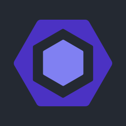

# MOBAIcons

<table>
  <tr>
    <td align="center" width="1000"> Angular</td>
    <td align="center" width="1000"> Animejs</td>
    <td align="center" width="1000"> Anthropic</td>
  </tr>
  <tr>
    <td align="center" width="1000"> Astro</td>
    <td align="center" width="1000"> Auk Browser</td>
    <td align="center" width="1000"> AWS</td>
  </tr>
  <tr>
    <td align="center" width="1000"> Axios</td>
    <td align="center" width="1000"> Azure</td>
    <td align="center" width="1000"> Babel</td>
  </tr>
  <tr>
    <td align="center" width="1000"> Biome</td>
    <td align="center" width="1000"> Blitz</td>
    <td align="center" width="1000"> Bolt</td>
  </tr>
  <tr>
    <td align="center" width="1000"> Bootstrap</td>
    <td align="center" width="1000"> Bun</td>
    <td align="center" width="1000"> C</td>
  </tr>
  <tr>
    <td align="center" width="1000"> Clerk</td>
    <td align="center" width="1000"> Cloudflare</td>
    <td align="center" width="1000"> Color4bg</td>
  </tr>
  <tr>
    <td align="center" width="1000"> Cpp</td>
    <td align="center" width="1000"> Crossplane</td>
    <td align="center" width="1000"> Css</td>
  </tr>
  <tr>
    <td align="center" width="1000"> Cursor</td>
    <td align="center" width="1000"> Cypress</td>
    <td align="center" width="1000"> Daisyui</td>
  </tr>
  <tr>
    <td align="center" width="1000"> Deepseek</td>
    <td align="center" width="1000"> Dify</td>
    <td align="center" width="1000"> Dioxus</td>
  </tr>
  <tr>
    <td align="center" width="1000"> Django</td>
    <td align="center" width="1000"> Docker</td>
    <td align="center" width="1000"> Dotenv</td>
  </tr>
  <tr>
    <td align="center" width="1000"> Dotenvx</td>
    <td align="center" width="1000"> Drizzle</td>
    <td align="center" width="1000"> Electron Vite</td>
  </tr>
  <tr>
    <td align="center" width="1000"> Electron</td>
    <td align="center" width="1000"> Elysiajs</td>
    <td align="center" width="1000"> Ember</td>
  </tr>
  <tr>
    <td align="center" width="1000"> Eslint</td>
    <td align="center" width="1000"> Excalidraw</td>
    <td align="center" width="1000"> Expo</td>
  </tr>
  <tr>
    <td align="center" width="1000"> Expressjs</td>
    <td align="center" width="1000"> Fastapi</td>
    <td align="center" width="1000"> Fastify</td>
  </tr>
  <tr>
    <td align="center" width="1000"> Figma</td>
    <td align="center" width="1000"> Firebase Studio</td>
    <td align="center" width="1000"> Flashlist</td>
  </tr>
  <tr>
    <td align="center" width="1000"> Flask</td>
    <td align="center" width="1000"> Flowbite</td>
    <td align="center" width="1000"> Flutter</td>
  </tr>
  <tr>
    <td align="center" width="1000"> Foundation Agents</td>
    <td align="center" width="1000"> Framermotion</td>
    <td align="center" width="1000"> Fresh</td>
  </tr>
  <tr>
    <td align="center" width="1000"> Fusionapp</td>
    <td align="center" width="1000"> Gatsby</td>
    <td align="center" width="1000"> Gemini</td>
  </tr>
  <tr>
    <td align="center" width="1000"> Gin</td>
    <td align="center" width="1000"> Git</td>
    <td align="center" width="1000"> Github</td>
  </tr>
  <tr>
    <td align="center" width="1000"> Gitlab</td>
    <td align="center" width="1000"> Go</td>
    <td align="center" width="1000"> Grok</td>
  </tr>
  <tr>
    <td align="center" width="1000"> Grpc</td>
    <td align="center" width="1000"> Gsap</td>
    <td align="center" width="1000"> Headlessui</td>
  </tr>
  <tr>
    <td align="center" width="1000"> Heroui</td>
    <td align="center" width="1000"> Home Assistant</td>
    <td align="center" width="1000"> Html</td>
  </tr>
  <tr>
    <td align="center" width="1000"> Huggingface</td>
    <td align="center" width="1000"> I18next</td>
    <td align="center" width="1000"> Inlang</td>
  </tr>
  <tr>
    <td align="center" width="1000"> Inspira Ui</td>
    <td align="center" width="1000"> Java</td>
    <td align="center" width="1000"> Javascript</td>
  </tr>
  <tr>
    <td align="center" width="1000"> Jest</td>
    <td align="center" width="1000"> Json</td>
    <td align="center" width="1000"> Kernelsu</td>
  </tr>
  <tr>
    <td align="center" width="1000"> Kotlin</td>
    <td align="center" width="1000"> Kubernetes</td>
    <td align="center" width="1000"> Legend</td>
  </tr>
  <tr>
    <td align="center" width="1000"> Lmstudio</td>
    <td align="center" width="1000"> Lsposed</td>
    <td align="center" width="1000"> Lua</td>
  </tr>
  <tr>
    <td align="center" width="1000"> Lunacy</td>
    <td align="center" width="1000"> Lynx</td>
    <td align="center" width="1000"> Magisk</td>
  </tr>
  <tr>
    <td align="center" width="1000"> Mantine</td>
    <td align="center" width="1000"> Manus</td>
    <td align="center" width="1000"> Matlab</td>
  </tr>
  <tr>
    <td align="center" width="1000"> Mdn</td>
    <td align="center" width="1000"> Mermaid</td>
    <td align="center" width="1000"> Mgx</td>
  </tr>
  <tr>
    <td align="center" width="1000"> Mistral</td>
    <td align="center" width="1000"> Mongodb</td>
    <td align="center" width="1000"> Motion</td>
  </tr>
  <tr>
    <td align="center" width="1000"> Mui</td>
    <td align="center" width="1000"> Mysql</td>
    <td align="center" width="1000"> Nestjs</td>
  </tr>
  <tr>
    <td align="center" width="1000"> Netlify</td>
    <td align="center" width="1000"> Nextjs</td>
    <td align="center" width="1000"> Nodejs</td>
  </tr>
  <tr>
    <td align="center" width="1000"> Npm</td>
    <td align="center" width="1000"> Nuxtjs</td>
    <td align="center" width="1000"> Ollama</td>
  </tr>
  <tr>
    <td align="center" width="1000"> Open Webui</td>
    <td align="center" width="1000"> Openai</td>
    <td align="center" width="1000"> Openhands</td>
  </tr>
  <tr>
    <td align="center" width="1000"> Openmanus</td>
    <td align="center" width="1000"> Openrouter</td>
    <td align="center" width="1000"> Photo Editor</td>
  </tr>
  <tr>
    <td align="center" width="1000"> Php</td>
    <td align="center" width="1000"> Pinia Plugin Persistedstate</td>
    <td align="center" width="1000"> Pinia</td>
  </tr>
  <tr>
    <td align="center" width="1000"> Pnpm</td>
    <td align="center" width="1000"> Postgresql</td>
    <td align="center" width="1000"> Postman</td>
  </tr>
  <tr>
    <td align="center" width="1000"> Powershell</td>
    <td align="center" width="1000"> Powertoys</td>
    <td align="center" width="1000"> Prettier</td>
  </tr>
  <tr>
    <td align="center" width="1000"> Prisma</td>
    <td align="center" width="1000"> Python</td>
    <td align="center" width="1000"> Qt</td>
  </tr>
  <tr>
    <td align="center" width="1000"> Qwen</td>
    <td align="center" width="1000"> Qwik</td>
    <td align="center" width="1000"> React</td>
  </tr>
  <tr>
    <td align="center" width="1000"> React Router</td>
    <td align="center" width="1000"> Reactbits</td>
    <td align="center" width="1000"> Reactnavigation</td>
  </tr>
  <tr>
    <td align="center" width="1000"> Redis</td>
    <td align="center" width="1000"> Redux</td>
    <td align="center" width="1000"> Reflex</td>
  </tr>
  <tr>
    <td align="center" width="1000"> Remix</td>
    <td align="center" width="1000"> Rspeedy</td>
    <td align="center" width="1000"> Ruby</td>
  </tr>
  <tr>
    <td align="center" width="1000"> Rust</td>
    <td align="center" width="1000"> Salvo</td>
    <td align="center" width="1000"> Shadcn</td>
  </tr>
  <tr>
    <td align="center" width="1000"> Solid</td>
    <td align="center" width="1000"> Soybean Sec</td>
    <td align="center" width="1000"> Spring</td>
  </tr>
  <tr>
    <td align="center" width="1000"> Supabase</td>
    <td align="center" width="1000"> Svelte</td>
    <td align="center" width="1000"> Swift</td>
  </tr>
  <tr>
    <td align="center" width="1000"> Swr</td>
    <td align="center" width="1000"> Tailwindcss</td>
    <td align="center" width="1000"> Tamagui</td>
  </tr>
  <tr>
    <td align="center" width="1000"> Tanstack</td>
    <td align="center" width="1000"> Taro</td>
    <td align="center" width="1000"> Tauri</td>
  </tr>
  <tr>
    <td align="center" width="1000"> Tldraw</td>
    <td align="center" width="1000"> Trpc</td>
    <td align="center" width="1000"> Turbo</td>
  </tr>
  <tr>
    <td align="center" width="1000"> Typegpu</td>
    <td align="center" width="1000"> Typescript</td>
    <td align="center" width="1000"> Uiverse</td>
  </tr>
  <tr>
    <td align="center" width="1000"> Unocss</td>
    <td align="center" width="1000"> Vastsea</td>
    <td align="center" width="1000"> Vb</td>
  </tr>
  <tr>
    <td align="center" width="1000"> Vercel</td>
    <td align="center" width="1000"> Visx</td>
    <td align="center" width="1000"> Vite</td>
  </tr>
  <tr>
    <td align="center" width="1000"> Vitest</td>
    <td align="center" width="1000"> Void</td>
    <td align="center" width="1000"> Vue Data Ui</td>
  </tr>
  <tr>
    <td align="center" width="1000"> Vue Vine</td>
    <td align="center" width="1000"> Vue</td>
    <td align="center" width="1000"> Warp</td>
  </tr>
  <tr>
    <td align="center" width="1000"> Windsurf</td>
    <td align="center" width="1000"> Xai</td>
    <td align="center" width="1000"> Zed</td>
  </tr>
  <tr>
    <td align="center" width="1000"> Zen Browser</td>
    <td align="center" width="1000"> Zod</td>
    <td align="center" width="1000"> Zustand</td>
  </tr>
</table>
