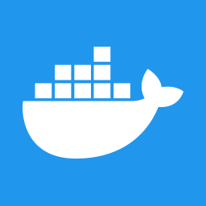
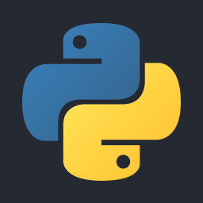

# MOBAIcons

<table>
  <tr>
    <td align="center" width="1000"> Astro</td>
    <td align="center" width="1000"> Bun</td>
    <td align="center" width="1000"> CSS</td>
  </tr>
  <tr>
    <td align="center" width="1000"> Docker</td>
    <td align="center" width="1000"> Electron</td>
    <td align="center" width="1000"> ElysiaJS</td>
  </tr>
  <tr>
    <td align="center" width="1000"> Flutter</td>
    <td align="center" width="1000"> Gin</td>
    <td align="center" width="1000"> Go</td>
  </tr>
  <tr>
    <td align="center" width="1000"> HTML</td>
    <td align="center" width="1000"> Java</td>
    <td align="center" width="1000"> JavaScript</td>
  </tr>
  <tr>
    <td align="center" width="1000"> Kotlin</td>
    <td align="center" width="1000"> Next.js</td>
    <td align="center" width="1000"> NPM</td>
  </tr>
  <tr>
    <td align="center" width="1000"> PHP</td>
    <td align="center" width="1000"> Pinia</td>
    <td align="center" width="1000"> Prisma</td>
  </tr>
  <tr>
    <td align="center" width="1000"> Python</td>
    <td align="center" width="1000"> React</td>
    <td align="center" width="1000"> Rust</td>
  </tr>
  <tr>
    <td align="center" width="1000"> Salvo</td>
    <td align="center" width="1000"> Supabase</td>
    <td align="center" width="1000"> Svelte</td>
  </tr>
  <tr>
    <td align="center" width="1000"> TailwindCSS</td>
    <td align="center" width="1000"> Tauri</td>
    <td align="center" width="1000"> TypeScript</td>
  </tr>
  <tr>
    <td align="center" width="1000"> Vue</td>
  </tr>
</table>
